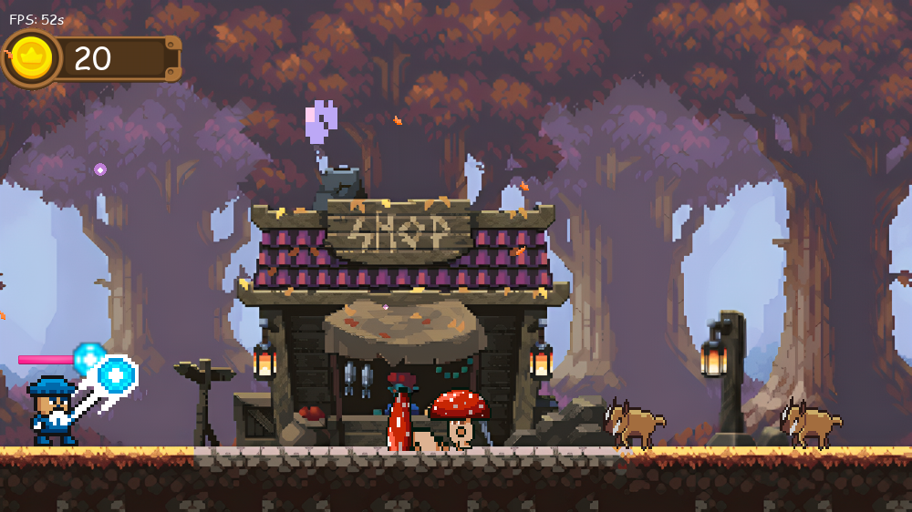
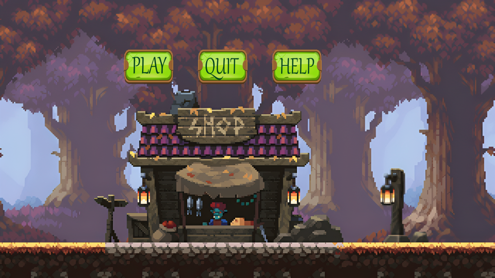
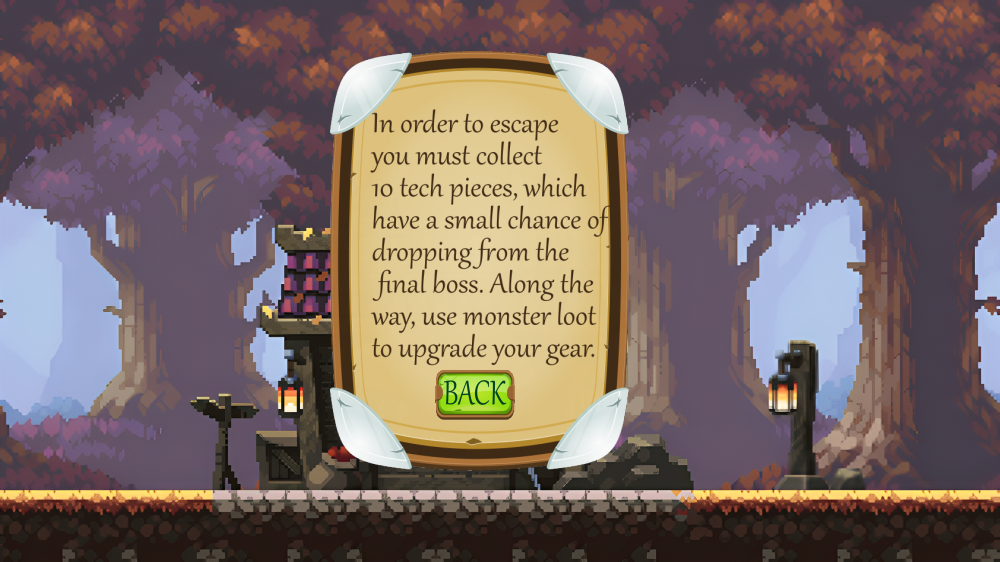
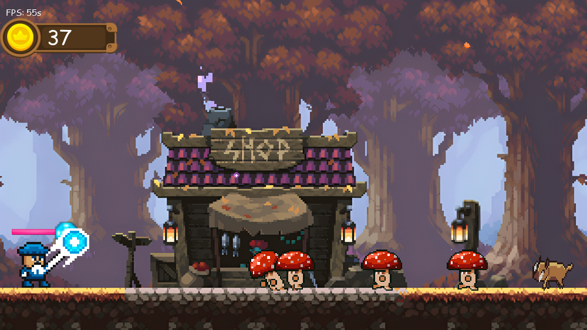
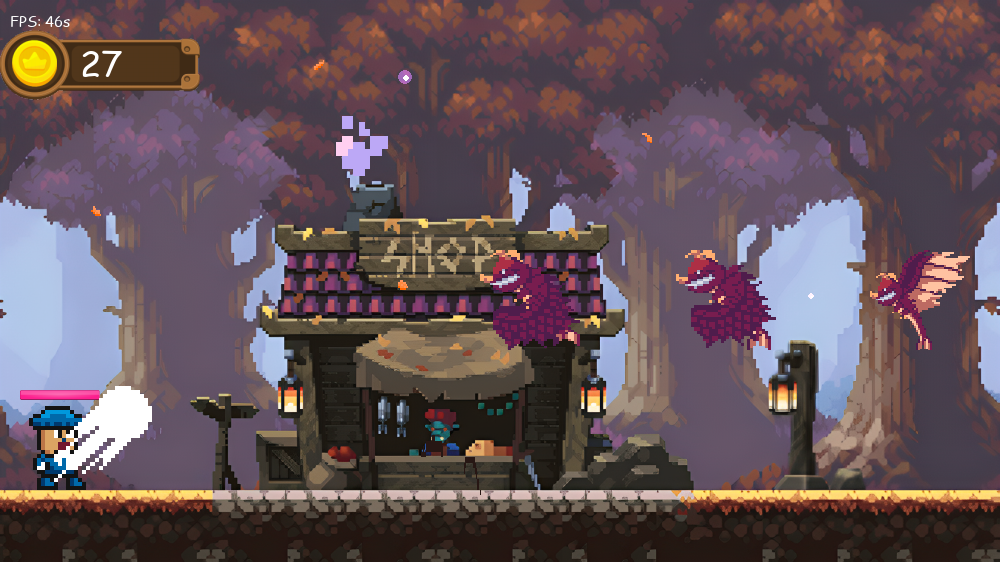
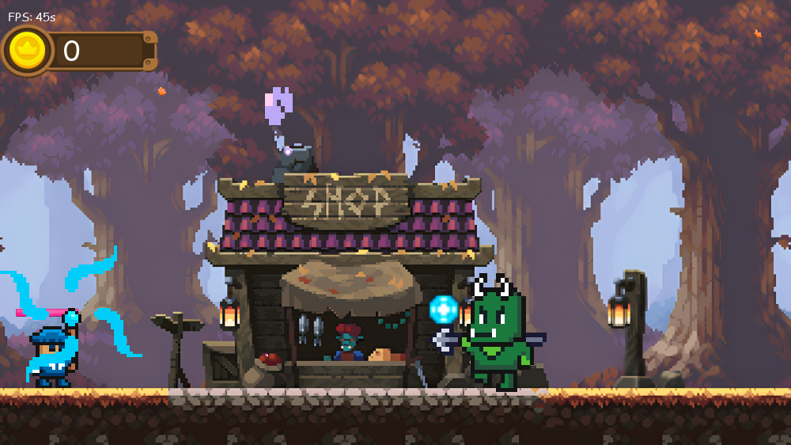

# Beast Loop — Time Loop Defence

A 2D wave-based defence game built with [Pygame](https://www.pygame.org/). You play a wizard standing at the left edge of a forest. Waves of monsters charge in from the right, and you blast them with magic bolts before they reach you. Each kill drops coins, and every wave is larger and spawns faster than the last, ending in a boss fight with an Orc.



---

## Table of Contents

- [Screenshots](#screenshots)
- [Features](#features)
- [Getting Started](#getting-started)
- [How to Play](#how-to-play)
- [Enemies](#enemies)
- [Wave Progression](#wave-progression)
- [Project Structure](#project-structure)
- [How the Code Works](#how-the-code-works)
- [Tweaking the Game](#tweaking-the-game)
- [Known Issues and Limitations](#known-issues-and-limitations)
- [Roadmap](#roadmap)

---

## Screenshots

| Main menu | Help screen |
| --- | --- |
|  |  |

| A wave of mushrooms and boars | Dragons swooping in |
| --- | --- |
|  |  |

| Orc boss fight |
| --- |
|  |

---

## Features

- **Mouse-aimed spellcasting.** Click to cast. The bolt flies toward wherever your cursor is.
- **Four enemy types**, each with its own sprite animations, health, and coin reward, including a flying dragon that dives at you and an Orc boss.
- **Wave system** with difficulty scaling: more enemies per wave and shorter gaps between spawns.
- **Coin drops** you collect by hovering the mouse over them.
- **Animated sprites** for running, getting hit, and dying, driven by frame counters.
- **Ambient effects:** falling leaves, glowing particles, and animated chimney smoke.
- **Sound design:** looping background music plus sound effects for spells, hits, deaths, and coin pickups.
- **Menu screens:** a main menu with Play, Help, and Quit, and an instructions screen.
- **Pixel-perfect collision** using `pygame.mask`.

---

## Getting Started

### Requirements

- **Python 3.12+** (developed on Python 3.12 and 3.13)
- **Pygame 2.x** (tested with pygame 2.6.1)

### Installation

```bash
# Clone the repository
git clone https://github.com/HarjotSingh18/Beast-Loop.git
cd Beast-Loop

# (Optional) create and activate a virtual environment
python3 -m venv .venv
source .venv/bin/activate        # On Windows: .venv\Scripts\activate

# Install pygame
pip install pygame
```

### Running the Game

```bash
python3 BeastLoop.py
```

> **Important:** Run the game from the project's root directory. All images and sounds are loaded with relative paths such as `images/...` and `sound/...`, so launching from another directory raises a `FileNotFoundError`.

---

## How to Play

| Action | Control |
| --- | --- |
| Cast a spell | **Left mouse click.** The bolt travels toward the cursor. |
| Collect coins | **Hover the mouse** over a dropped coin |
| Navigate menus | **Click** the Play / Help / Quit / Back buttons |
| Quit | Close the window |

### Rules

- You start with **10 health**. Any enemy that reaches you costs **5 health** and is destroyed on contact.
- Casting has a **0.3 second cooldown**. The bolt fires partway through the wizard's casting animation, toward the cursor's position at that moment.
- Your spells do **4 damage** each.
- Defeated enemies drop coins that slowly fall to the ground. Hover over them to collect them.
- If your health reaches 0, the run ends and you return to the main menu.
- Survive all the waves and defeat the Orc boss to finish the run. You are then returned to the main menu.

The **coin counter** and an FPS counter are shown in the top-left of the screen. The **health bar** sits just above the wizard.

---

## Enemies

| Enemy | Health | Speed | Coins | Notes |
| --- | --- | --- | --- | --- |
| 🍄 **Mushroom** | 1 | 2 | 1 | Has run, hit, and death animations |
| 🐗 **Boar** | 2 | 2 | 2 | Ground charger |
| 🐉 **Dragon** | 3 | 2 | 3 | Flies in high, then **dives downward** once it gets close to you |
| 👹 **Orc (Boss)** | 20 | 1 | 5 | Slow and tanky. It takes 5 hits at base damage. |

---

## Wave Progression

The game tracks a `wave` number and a `cycle` counter. After each wave is cleared, the next wave spawns more enemies, and the delay between individual spawns drops by 0.5 seconds.

| Wave | Enemies | Spawn interval |
| --- | --- | --- |
| 1 | 1 Mushroom, 1 Boar, 1 Dragon | 3.0 s |
| 2 | 2 of each | 2.5 s |
| 3 | 3 of each | 2.0 s |
| 4 | 4 of each | 1.5 s |
| 5 — **Boss** | 1 Orc | 1.0 s |

After the boss wave, `get_enemy_set()` returns no enemies, and the game ends and returns to the main menu.

> In code, waves are numbered starting at `wave = 2`, so the regular waves are `wave` 2–5 and the boss is `wave == 6`.

---

## Project Structure

```
.
├── BeastLoop.py        # Entry point: window, menus, main game loop, wave system, HUD drawing
├── Player.py           # Player sprite: casting animation, health, damage, coins
├── Enemies.py          # Base Enemy class + Mushroom, Boar, Dragon, Orc subclasses and sprite groups
├── EnemyDrops.py       # Coin drops: falling animation and mouse-hover pickup
├── Weapons.py          # PlayerBullet: mouse-aimed projectile with velocity from atan2
├── Particles.py        # Glowing ambient particles (additive-blend glow)
├── FallingLeaves.py    # Animated falling leaf sprites
├── SmokeAnimation.py   # Looping chimney smoke animation on the background
├── Sounds.py           # Shared sound effects (hit, death, spell, coin)
├── Shop.py             # Placeholder for the upgrade shop (currently empty)
├── images/
│   ├── GUI/            # Health bar, coin bar, coin animation frames
│   ├── enemies/        # bat/, boar/, dragon/, mushroom/, orc_boss/ animation frames
│   ├── location/       # Background, leaves, smoke frames
│   ├── menu/           # Menu board, instructions, and button images
│   ├── player/         # Wizard animation frames and upgrade icons
│   └── weapons/        # Staff and projectile sprites
└── sound/              # Background music and sound effects (.mp3 / .wav)
```

---

## How the Code Works

### Game flow

```
menu() ──Play──▶ main() ──player dies / all waves cleared──▶ returns to menu()
   │
   └──Help──▶ help() ──Back──▶ returns to menu()
```

- **`menu()`** is the one long-running loop. It draws the title screen and waits for a click. `main()` and `help()` return to it when they finish. Closing the window or clicking Quit calls `quit_game()`, which shuts down pygame and exits.
- **`main()`** resets every sprite group, creates the `Player`, and runs the 60 FPS game loop:
  1. Handles input. A left click sets the player's state to `"hitting"`, which starts the cast animation.
  2. Runs the **wave system**. When the current enemy list is empty, it builds the next one.
  3. Calls **`spawn_enemies()`**, which adds one unspawned enemy to its sprite group every `spawn_rate` seconds and removes dead enemies from the wave list.
  4. Ends the run if the player's health has reached 0.
  5. Calls **`draw()`**, which renders the background, HUD, leaves, enemies, drops, bullets, smoke, and player.
  6. Draws the ambient particles on top and updates the display once.

### Sprites and animation

Every animated object is a `pygame.sprite.Sprite` subclass that holds lists of frames and a per-animation counter. Each frame increments the counter. When it passes the animation's speed threshold, the sprite moves to the next frame. A higher speed value means a slower animation.

`Enemy` is a state machine with the states `running`, `hit`, and `dead`:
- `hit` plays the hit animation, if the enemy has one, then returns to `running`.
- `dead` stops movement, plays the death animation, spawns an `EnemyDrop`, and finally calls `kill()`.

### Collision

Collisions use **masks** (`pygame.mask.from_surface`) and `mask.overlap(...)` for pixel-accurate hits:
- Enemy mask against player mask: the player takes damage and the enemy is removed.
- Bullet mask against enemy mask: the enemy takes damage and the bullet is removed.

### Aiming

`PlayerBullet` computes the angle from the staff to the mouse with `math.atan2`, then splits a fixed speed into `x_vel` and `y_vel` components with `cos` and `sin`.

---

## Tweaking the Game

Most balance values are plain constants that are easy to change:

| What | Where |
| --- | --- |
| Screen size | `WIDTH, HEIGHT` in `BeastLoop.py` |
| Frame rate | `fps` in `BeastLoop.py` |
| Fire rate (cooldown) | `fire_Rate` in `main()` |
| Starting spawn interval | `spawn_rate` in `main()` |
| Wave composition / boss | `get_enemy_set()` in `BeastLoop.py` |
| Enemy health | The third argument when constructing enemies in `get_enemy_set()` |
| Enemy speed & coin value | Each enemy subclass in `Enemies.py` |
| Player health / damage | `player_health`, `damage`, `damage_multiplier` in `Player.py` |
| Bullet speed | `self.speed` in `Weapons.py` |
| Volume levels | `set_volume(...)` calls in `Sounds.py`, `Player.py`, `BeastLoop.py` |

---

## Known Issues and Limitations

- **The shop is not implemented.** `Shop.py` is empty and `shop()` in `BeastLoop.py` is a stub. The upgrade icons (power and health) are loaded, but `draw_upgrades()` is never called.
- **There is only one run.** After the boss wave, the game returns to the menu. There is no endless mode or looping beyond wave 5 yet.
- **There is no game-over screen.** Dying or winning sends you straight back to the main menu.
- **Sounds are loaded twice.** `Player.py` and `Sounds.py` each load the same sounds.
- **The project must be launched from its root directory** because assets use relative paths.

---

## Roadmap

- [ ] Game-over and victory screens
- [ ] Coin shop between waves for damage and health upgrades
- [ ] Endless "loop" mode with scaling waves after the boss
- [ ] Use the unused bat and Orc attack animations, and the dragon's glide frames for its dive
- [ ] Add a `requirements.txt` and a `.gitignore` for `__pycache__/`

---

*Built with Python and Pygame.*
